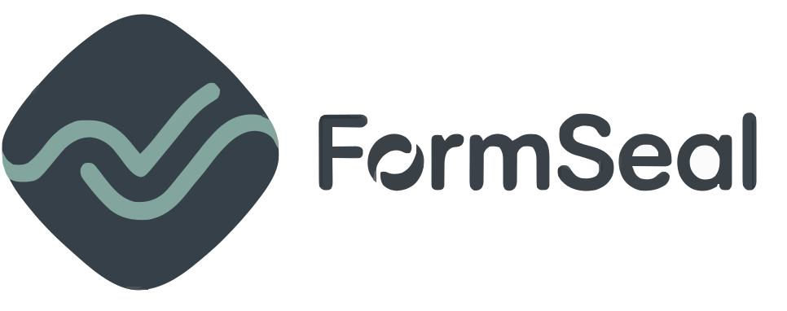
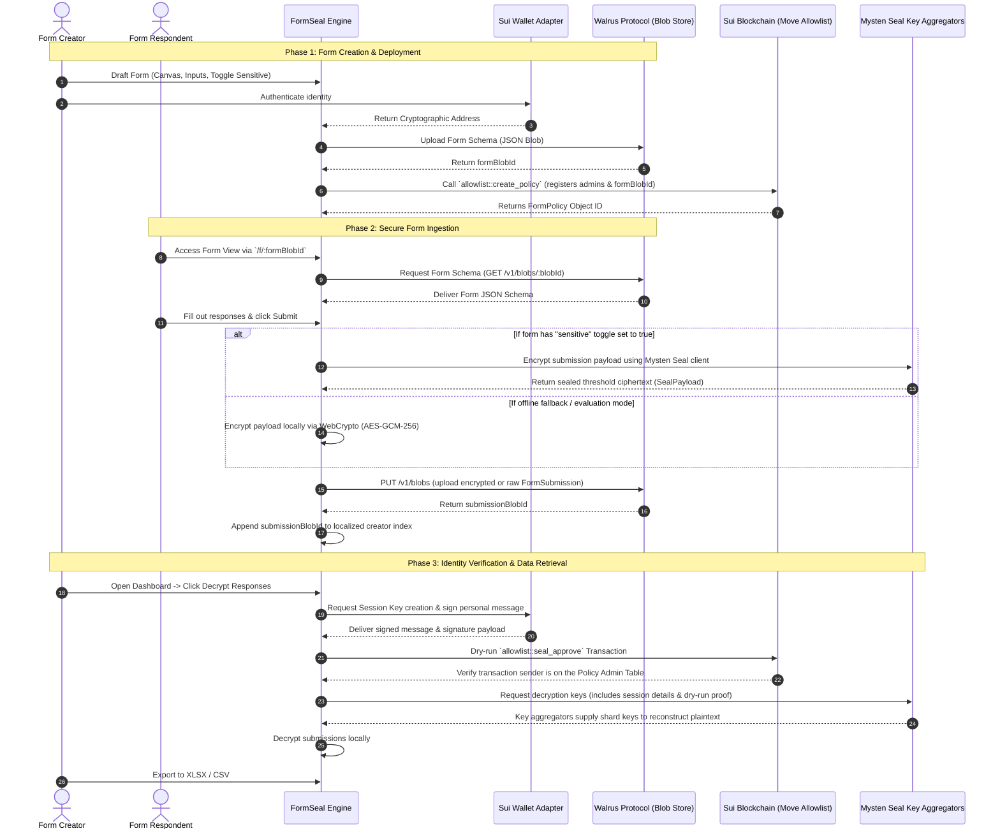

# FormSeal

<p align="center">
  
</p>

<h3 align="center">FORMSEAL</h3>


<p align="center">
  <strong>A simple drag and drop form builder to create forms, collect responses, and own your data forever.</strong>
</p>

<p align="center">
  <a href="https://vite.dev/"></a>
  <a href="https://react.dev/"></a>
  <a href="https://typescriptlang.org/"></a>
  <a href="https://sui.io/"></a>
  <a href="https://walrus.xyz/"></a>
</p>

---

## 1. Product Overview

 **FormSeal** A simple drag and drop form builder to create forms, collect responses, and own your data forever permanently on Walrus, ensuring complete ownership of your data. FormSeal delivers **permanent form hosting** and **privacy-preserving response ingestion** through a zero-trust model.

### Key Capabilities
- **Decentralized Permanence**: Form schemas and submissions are written directly as immutable blobs to the **Walrus Protocol** mainnet, making them immortal, censorship-resistant, and instantly accessible.
- **Threshold Cryptography**: Sensitive response fields are protected via **`@mysten/seal`**, a cryptographic framework that encrypts data on-the-fly. Ciphertext can only be reconstructed by query requests authorized through a Sui Move allowlist smart contract.
- **Editorial Design Aesthetic**: A high-fidelity, boxed minimalist layout featuring a canvas-first editor grid, uniform 8px border geometry, precise 1px hairline elements, dynamic typography scaling, and fluid spring physics.
- **Web3 Identity Integration**: Fully integrated with the Sui network via **`@mysten/dapp-kit`**, enabling users to manage templates, establish cryptographic session leases, sign verification transactions, and verify form ownership.

---

## 2. Dynamic Core Architecture

FormSeal splits its processes into decoupled UI engines, permanent storage aggregators, and decentralized identity verification nodes. The following diagram illustrates the complete form lifecycle, from builder layout creation to cryptographically secure verification and data download.



---

## 3. High-Fidelity UI/UX & Design Tokens

FormSeal is constructed on a **Premium Utilitarian Minimalist** aesthetic system. Every view complies with strict spatial parameters and responsive layouts:

- **Geometric Grid Hierarchy**: Uses an 8px grid basis (`0.5rem` = `8px`, `1rem` = `16px`, `1.5rem` = `24px`).
- **Canvas-First Layout**: Anchor points are configured on a dynamic `1fr 280px 320px` grid inside the builder workspace, placing the drafting canvas prominently to the left and consolidating inspectors and toolbars on the right to optimize structural space.
- **Double-Bezel Borders**: Containers feature nesting hairlines (`border-black/[0.04]`) offset by deep shadows (`shadow-[0_12px_32px_-4px_rgba(0,0,0,0.04)]`) and solid `#fafafa` backdrops.
- **Styling Uniformity**: Interactive buttons, input fields, dropdown menus, and utility icons share a strict `8px` (`rounded-xl` or `rounded-lg`) border-radius and standard heights (`h-12` or `h-14`) to ensure typographic alignment.
- **snappy Motion**: Framework interactions use only hardware-accelerated transformation and opacity properties, resulting in zero-repaint animations. Includes comprehensive `prefers-reduced-motion` compliance.

---

## 4. Front-End Technical Stack

The client application is built as a compiled Single Page Application (SPA) using a modern utility stack:

| Technology | Dependency | Purpose |
| :--- | :--- | :--- |
| **Core Framework** | React v19.2.5 | Structural componentization and virtualized DOM management. |
| **Type Integrity** | TypeScript v6.0.2 | Compile-time typings and static interface validation. |
| **Bundler / Server** | Vite v8.0.10 | Instant Hot Module Replacement (HMR) and optimized rollup compilation. |
| **State Engine** | Zustand v5.0.13 | Persistent reactive global store with integrated local-storage synchronization. |
| **Styling Engine** | Tailwind CSS v4.2.4 | Atomic classes, dynamic layout composition, and utility-first design tokens. |
| **Animation System** | Framer Motion v12.38.0 | Spring physics-driven UI animations and item reordering layouts. |
| **Decentralized Core** | `@mysten/sui` v2.16.2 | JSON-RPC connectivity, client connections, and transaction builders. |
| **Leased Cryptography** | `@mysten/seal` v1.1.3 | Threshold cryptography client for encryption and session lease routines. |
| **Wallet Connector** | `@mysten/dapp-kit` v1.0.6 | Standardized wallet adapter, network synchronization, and credential query contexts. |
| **Rich Text Editor** | Tiptap Editor v3.22.5 | Integrated editable fields, customizable styles, and rich text schema blocks. |
| **Drag & Drop Engine** | `@dnd-kit/core` v6.3.1 | Smooth interactive sorting, field shifting, and layout placement. |
| **Data Engine** | `xlsx` v0.18.5 | Client-side spreadsheet builder (SheetJS) and data compilation. |

---

## 5. Sui Move Smart Contract Architecture

The validation gate is handled by a custom Move module deployed on the **Sui Blockchain**. It regulates access control policies for decryption requests processed by the Mysten Seal key aggregators.

### Smart Contract: `allowlist.move`
- **Location**: `move/formseal/sources/allowlist.move`
- **Identity Scheme**: Cryptographic decryption rights are mapped to a distinct namespace derived from `[PackageId][bcs::to_bytes(form_blob_id)]`. This encapsulates encryption keys on a per-form basis.
- **Admin Table**: A shared `FormPolicy` object stores a dynamic `Table<address, bool>` listing authorized administrators (form creators and designees).
- **Decryption Approval (`seal_approve`)**: 
  - To request decryption keys from Seal key servers, the user's client performs a client dry-run execution of the `seal_approve` entrypoint.
  - The key servers dry-run this transaction. If the caller (sender address) is on the administrator table and the form identifier matches, the transaction completes successfully, validating the caller's rights. The key servers then provide the decryption key shards.

```rust
module formseal::allowlist {
    use sui::event;
    use sui::table::{Self, Table};

    // Error Codes
    const ENotAdmin: u64 = 0;
    const EAlreadyAdmin: u64 = 1;
    const ENotOnAllowlist: u64 = 2;
    const ECannotRemoveSelf: u64 = 3;

    // Events
    public struct AdminAdded has copy, drop {
        policy_id: ID,
        admin: address,
        added_by: address,
    }

    public struct FormPolicy has key {
        id: UID,
        form_id: vector<u8>, // Walrus blob ID of the form schema
        admins: Table<address, bool>,
        admin_count: u64,
    }

    /// Creates a new FormPolicy object. The creator address is added as the initial administrator.
    public fun create_policy(
        form_id: vector<u8>,
        ctx: &mut TxContext,
    ): ID { ... }

    /// Grants administrator privileges to another address.
    public fun add_admin(
        policy: &mut FormPolicy,
        new_admin: address,
        ctx: &TxContext,
    ) { ... }

    /// The evaluation gate invoked by Seal key servers during dry-runs.
    /// Access is granted if the caller is an active policy administrator.
    entry fun seal_approve(
        id: vector<u8>,
        policy: &FormPolicy,
        ctx: &TxContext,
    ) {
        assert!(policy.admins.contains(ctx.sender()), ENotOnAllowlist);
        assert!(id == policy.form_id, ENotOnAllowlist);
    }
}
```

---

## 6. Form Schema Technical Specification

Form configurations are converted to a highly structured JSON document before being uploaded to Walrus. This format enables standardized rendering on the submission page.

### Example Form Schema JSON Payload
```json
{
  "id": "e7b8a1c0-0f2c-4b5d-9c3e-8a0b1c2d3e4f",
  "title": "Developer Feedback Form",
  "description": "Please provide feedback regarding your experience using the decentralized FormSeal workspace.",
  "accentColor": "#6366f1",
  "sensitive": true,
  "fields": [
    {
      "id": "field_1a2b3c",
      "type": "short_text",
      "label": "Full Name",
      "placeholder": "Enter your response...",
      "required": true
    },
    {
      "id": "field_4d5e6f",
      "type": "email",
      "label": "Corporate Email Address",
      "placeholder": "dev@company.com",
      "required": true
    },
    {
      "id": "field_7g8h9i",
      "type": "star_rating",
      "label": "Overall Studio Usability Rating",
      "required": false
    },
    {
      "id": "field_1j2k3l",
      "type": "checkbox_group",
      "label": "Primary Development Stack",
      "required": true,
      "options": [
        { "id": "opt_react", "label": "React / NextJS" },
        { "id": "opt_sui", "label": "Sui Move Smart Contracts" },
        { "id": "opt_walrus", "label": "Walrus Decentralized Storage" }
      ]
    }
  ],
  "creatorAddress": "0x0000000000000000000000000000000000000000000000000000000000000000",
  "createdAt": 1778968940000,
  "version": 1,
  "hasCover": true,
  "coverUrl": "https://images.unsplash.com/photo-1618005182384-a83a8bd57fbe?q=80&w=2564&auto=format&fit=crop",
  "logoUrl": "https://images.unsplash.com/photo-1606857521015-7f9fcf423740",
  "showIcon": true
}
```

---

## 7. Codebase Directory Map

```bash
formseal/
├── move/                       # Sui Move Smart Contracts
│   └── formseal/
│       ├── Move.toml           # Package configuration & dependencies
│       └── sources/
│           └── allowlist.move  # Decentralized access policy module
├── public/                     # Static assets & brand media files
├── src/                        # Core Application codebase
│   ├── assets/                 # Ambient backgrounds and vectors
│   ├── components/             # Reusable UI modules
│   │   ├── BuilderFieldCard.tsx  # Interactive card rendering for the builder
│   │   ├── Footer.tsx            # Clean editorial attribution footer
│   │   ├── FormFieldRenderer.tsx # Dynamic input fields rendering
│   │   ├── Navbar.tsx            # Navigation and dApp Kit wallet triggers
│   │   ├── ToastContainer.tsx    # Transaction and error alert feedback
│   │   └── ui.tsx                # Styled atomic buttons, cards, and markers
│   ├── lib/                    # Library abstraction layer
│   │   ├── seal.ts             # Seal threshold clients & WebCrypto fallbacks
│   │   └── walrus.ts           # Walrus aggregator/publisher API integrations
│   ├── pages/                  # Top-level application views
│   │   ├── BuilderPage.tsx     # Three-pane builder workspace
│   │   ├── DashboardPage.tsx   # Aggregated form insights & responses list
│   │   ├── FormViewPage.tsx    # Decoupled public response collection page
│   │   ├── LandingPage.tsx     # Hero page showcasing FormSeal sandbox
│   │   └── TemplatesPage.tsx   # Premium pre-configured layouts
│   ├── stores/                 # Unified reactive State stores
│   │   ├── appStore.ts         # User interface preferences & global indexes
│   │   └── builderStore.ts     # Active workspace editor state
│   ├── App.tsx                 # Core application routes & entrypoint
│   ├── index.css               # Global Tailwind CSS configurations
│   ├── main.tsx                # Bootstrapper wrapping Query, Sui & Wallet providers
│   └── types.ts                # Strict TypeScript types
├── package.json                # Project dependencies & configurations
├── tsconfig.json               # TypeScript configuration parameters
└── vite.config.ts              # Vite configurations
```

---

## 8. Installation & Local Development Setup

To initialize and run a localized instance of FormSeal, execute the following commands in order:

### Prerequisites
Make sure you have [NodeJS v18+](https://nodejs.org/) and the [Sui CLI](https://docs.sui.io/guides/developer/getting-started/sui-install) installed.

### 1. Clone & Install Dependencies
```bash
# Install NPM dependencies
npm install
```

### 2. Configure Local Environment Variables
Create a `.env` file in the root directory if custom endpoints are required:
```env
VITE_WALRUS_PUBLISHER=https://publisher.walrus-testnet.walrus.space
VITE_WALRUS_AGGREGATOR=https://aggregator.walrus-testnet.walrus.space
VITE_SEAL_POLICY_PACKAGE_ID=0x1234567890abcdef1234567890abcdef1234567890abcdef1234567890abcdef
```

### 3. Launch the Development Server
```bash
# Run local Vite development hot-reload server
npm run dev
```
Open [http://localhost:5173](http://localhost:5173) in your browser.

---

## 9. Smart Contract Build & Deployment Workflow

To compile and publish the Sui Move smart contract to mainnet, run the following steps:

### 1. Compile the Smart Contract
Ensure the code compiles without warnings:
```bash
cd move/formseal
sui move build
```

### 2. Deploy to Sui Mainnet
Deploy the compiled Move package to the network:
```bash
# Deploy move package using the active CLI profile
sui client publish --gas-budget 50000000
```

### 3. Save the Package ID
Copy the returned package ID and update `DEFAULT_SEAL_POLICY_PACKAGE_ID` inside `src/lib/seal.ts`:
```typescript
export const DEFAULT_SEAL_POLICY_PACKAGE_ID = "0x<your_deployed_package_id>";
```

---

## 10. Cryptographic Flow Detail

FormSeal implements an advanced data-sealing workflow to protect sensitive respondent information:

1. **Lease Initialization**:
   - The creator signs an on-chain message via their wallet adapter.
   - This creates an ephemeral `SessionKey` with a configured TTL (Time-To-Live) of 60 minutes.
2. **On-the-fly Encryption**:
   - During submission, sensitive inputs are parsed into a raw JSON string.
   - The `@mysten/seal` client encrypts this payload locally using a threshold key mapped to the form's identity.
   - The encrypted ciphertext is wrapped into a standardized `SealPayload` JSON object before upload.
3. **Decryption Authorization**:
   - When the creator requests response decryption via their dashboard, the client builds an transaction execution payload containing `allowlist::seal_approve`.
   - The client forwards this transaction execution payload to the Mysten Seal key aggregators.
   - The key aggregators evaluate the transaction against a network dry-run. Since the creator is an authorized administrator, the transaction returns successfully.
   - The key aggregators release the cryptographic shards to the client, which decrypts the ciphertext locally.

---

## 11. Production Build & Static Compilation

To generate optimized production bundles for static hosting:

```bash
# Compile TypeScript files and build the production distribution
npm run build
```

The resulting build is written to `/dist`, ready to be deployed to permanent file systems or standard static hosting providers.
